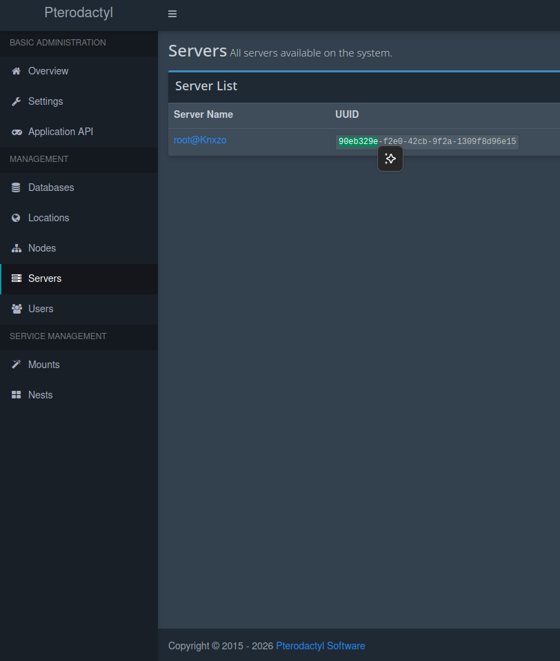

# ServerLock — Panduan Instalasi Lengkap (Bahasa Indonesia)

ServerLock adalah extension [Blueprint Framework](https://blueprint.zip) untuk panel
**Pterodactyl** yang memungkinkan admin mengunci akses ke server tertentu di
belakang password, sehingga server tidak bisa diintip/diakses oleh user lain
selain pemiliknya.

> Panduan ini sudah diperbarui total setelah proses debugging penuh di
> lingkungan produksi. Semua bug yang pernah ditemukan (lihat bagian
> [Riwayat Perbaikan](#riwayat-perbaikan-changelog)) sudah ditutup di
> `install.sh` versi ini.

---

## Daftar Isi

1. [Prasyarat](#1-prasyarat)
2. [Install Blueprint Framework](#2-install-blueprint-framework)
3. [Install ServerLock](#3-install-serverlock)
4. [Verifikasi Instalasi](#4-verifikasi-instalasi)
5. [Cara Pakai (Lock / Status / Unlock)](#5-cara-pakai-lock--status--unlock)
6. [Reset Password User](#6-reset-password-user)
7. [Troubleshooting](#7-troubleshooting)
8. [Riwayat Perbaikan (Changelog)](#riwayat-perbaikan-changelog)

---

## 1. Prasyarat

- VPS dengan **Pterodactyl Panel** yang sudah terinstall dan berjalan normal
  (default path: `/var/www/pterodactyl`).
- Akses **root**.
- Belum wajib punya Crimson Abyss atau extension lain — ServerLock berdiri
  sendiri, tidak bergantung pada extension pihak ketiga manapun.
- **Wajib** sudah terpasang **Blueprint Framework** (lihat bagian 2 kalau
  belum ada).

---

## 2. Install Blueprint Framework

Lewati bagian ini kalau `blueprint -version` di VPS kamu sudah jalan.

```bash
# 1. Set path Pterodactyl
export PTERODACTYL_DIRECTORY=/var/www/pterodactyl

# 2. Install dependency dasar
sudo apt update
sudo apt install -y curl wget unzip

# 3. Download & extract Blueprint (release terbaru)
cd "$PTERODACTYL_DIRECTORY"
wget "https://github.com/BlueprintFramework/framework/releases/latest/download/release.zip" -O "$PTERODACTYL_DIRECTORY/release.zip"
unzip -o release.zip

# 4. Install Node.js, yarn, dan dependency lain
sudo apt install -y ca-certificates curl git gnupg unzip wget zip

sudo mkdir -p /etc/apt/keyrings
curl -fsSL https://deb.nodesource.com/gpgkey/nodesource-repo.gpg.key | sudo gpg --dearmor -o /etc/apt/keyrings/nodesource.gpg
echo "deb [signed-by=/etc/apt/keyrings/nodesource.gpg] https://deb.nodesource.com/node_22.x nodistro main" | sudo tee /etc/apt/sources.list.d/nodesource.list
sudo apt update
sudo apt install -y nodejs

cd "$PTERODACTYL_DIRECTORY"
sudo npm i -g yarn
yarn install

# 5. Buat file konfigurasi .blueprintrc
echo \
'WEBUSER="www-data";
OWNERSHIP="www-data:www-data";
USERSHELL="/bin/bash";' > "$PTERODACTYL_DIRECTORY/.blueprintrc"

# 6. Jalankan installer Blueprint
chmod +x "$PTERODACTYL_DIRECTORY/blueprint.sh"
sudo bash "$PTERODACTYL_DIRECTORY/blueprint.sh"
```

> Sesuaikan `WEBUSER`/`OWNERSHIP` di `.blueprintrc` kalau webserver kamu
> bukan pakai user `www-data` (misal CentOS biasanya `nginx`).

Verifikasi:

```bash
blueprint -version
```

Kalau muncul versinya (contoh: `beta-2026-08`), lanjut ke bagian 3.

**Penting:** kalau di tengah jalan panel kamu tiba-tiba error 500, biasanya
`blueprint.sh` **aman dijalankan ulang** — dia idempotent dan akan
menampilkan `Blueprint is already installed` kalau memang sudah lengkap,
atau memperbaiki bagian yang kurang kalau ada yang hilang.

---

## 3. Install ServerLock

```bash
cd /var/www

git clone https://github.com/kenzow-OfficialHost/serverlock-final.git

cd serverlock-final

chmod +x install.sh

./install.sh
```

`install.sh` otomatis akan:

1. Cek kamu jalan sebagai root, panel & Blueprint valid.
2. Clone repo ServerLock ke folder sementara (`/tmp/serverlock-final-install`).
3. Backup semua file yang bakal ditimpa ke `/root/serverlock-backup-<tanggal>`.
4. Pasang runtime ServerLock (`app/`, `database/`, `resources/`, `routes/`).
5. Pasang folder `.blueprint/extensions/serverlock/` **secara lengkap**
   (termasuk `private/` yang berisi `conf.yml` — bagian yang paling sering
   kelewat di versi installer lama).
6. **Mendaftarkan ServerLock ke registry Blueprint** sehingga muncul di
   halaman `/admin/extensions`.
7. **Menambahkan alias webpack** secara otomatis kalau belum ada, supaya
   build frontend tidak gagal.
8. Menjalankan migration database.
9. Memperbaiki permission `storage` & `bootstrap/cache`.
10. Membersihkan cache Laravel & build ulang frontend
    (`yarn build:production`).
11. Validasi otomatis: cek command artisan, route, dan tabel database.

Kalau semua sukses, akan muncul ringkasan hijau di akhir output.

---

## 4. Verifikasi Instalasi

```bash
# Command artisan-nya harus muncul 3 baris ini
php artisan list | grep serverlock

# Cek isi registry Blueprint (harus ada kata 'serverlock')
cat /var/www/pterodactyl/.blueprint/extensions/blueprint/private/db/installed_extensions
```

Lalu buka di browser:

```
https://domain-panel-kamu/admin/extensions
```

Kartu **"Server Lock"** harus sudah muncul di sebelah kartu "Blueprint".

---

## 5. Cara Pakai (Lock / Status / Unlock)

Semua command ini **hanya bisa dijalankan dari VPS/SSH**, bukan dari
frontend admin — ini best practice supaya cuma orang yang punya akses
server (root) yang bisa mengunci/membuka server siapapun.

Argumen `{server}` boleh diisi salah satu dari:
- **ID server** (angka, contoh: `5`)
- **uuidShort** (8 karakter)
- **UUID penuh**

Cara cari ID/UUID: buka **Admin Panel → Servers**, klik server yang
dituju, lihat kolom UUID/Identifier di halaman detailnya.

> **PENTING:** command `php artisan` di bawah ini WAJIB dijalankan dari
> dalam folder panel Pterodactyl (`/var/www/pterodactyl`), **BUKAN** dari
> folder repo `serverlock-final`. Kalau muncul error
> `Could not open input file: artisan`, itu tandanya kamu belum pindah
> folder — jalankan `cd /var/www/pterodactyl` dulu.

**CARA MENCARI SERVER ID, SERVER UID KALIAN AKAN KELIATAN DENGAN MELIHAT DETAIL UID SERVER ->**


```bash
# masuk folder dulu
cd /var/www/pterodactyl

# Kunci pakai uid server kamu hash password server akan di tampilkan otomatis
# Kunci server (password otomatis di-generate, default 10 karakter)
php artisan serverlock:lock UUID SERVER KAMU
# Contoh= php artisan serverlock:lock eSer33s

# Kunci dengan panjang password custom
php artisan serverlock:lock {server} --length=16

# Lihat status satu server
php artisan serverlock:status ID SERVER

# Lihat status SEMUA server yang pernah di-lock (kosongkan argumen)
php artisan serverlock:status

# Buka kunci server
php artisan serverlock:unlock ID SERVER
```

Begitu server dikunci, saat user membuka halaman console server tersebut
di panel, mereka akan melihat layar **"Server Terkunci"** dan wajib
memasukkan password yang sudah di-generate sebelum bisa masuk.

---

## 5b. Keamanan (Baru di v3)

Perbedaan paling penting dari versi sebelumnya:

- **Enforcement sekarang di backend, bukan cuma di UI.** Middleware
  `EnsureServerUnlocked` jalan di semua route API client server
  (`/api/client/servers/{server}/**`) — termasuk websocket token console,
  file manager, database, backup. Sebelumnya lock cuma nyembunyiin
  tombol di React; sekarang API-nya sendiri nolak (`423 Locked`) kalau
  belum ada grant yang valid, jadi nggak bisa di-bypass lewat
  curl/Postman/devtools.
- **Password yang benar mengeluarkan "grant" berlaku 4 jam** (disimpan
  di tabel `ext_serverlock_unlocks`), bukan sekadar flag di React state.
  Artinya kalau refresh/pindah tab, kamu nggak perlu ngetik ulang
  password selama grant-nya belum kedaluwarsa.
- **Rate limit ganda di `/verify`:** `throttle:8,1` di level route, plus
  lockout 5 menit per (user, server) setelah 5 kali salah beruntun
  (tabel `ext_serverlock_attempts`) — jadi nggak gampang dihindari cuma
  dengan ganti IP.
- **Subuser yang memang ditambahkan ke server ikut bisa akses**, nggak
  cuma pemilik & root admin kayak sebelumnya.
- Root admin selalu bisa lewat lock (karena dialah yang mengunci lewat
  SSH).

**FAQ: "Kok kadang server kebuka sendiri tanpa password?"** Dua
kemungkinan, keduanya disengaja bukan bug:
1. Kamu (atau siapapun) pernah berhasil masukin password yang benar
   sebelumnya — grant-nya berlaku 4 jam, jadi dalam rentang itu nggak
   akan diminta password lagi sampai grant-nya habis.
2. Kamu login sebagai **root admin** — di level API selalu dibolehin
   lewat (biar admin yang ngunci nggak sampai ngunci diri sendiri
   total), walau tampilan tetap nampilin layar lock.

---

## 6. Reset Password User

```bash
/tmp/serverlock-final-install/scripts/serverlock-reset-user.sh USER_ID
```

---

## 7. Troubleshooting

### "Module not found: Can't resolve '@blueprint/extensions/serverlock/LockGate'"
`LockGate.tsx` belum ada di lokasi yang dibaca webpack. `webpack.config.js`
bawaan Blueprint sudah punya alias generic `@blueprint` yang mengarah ke
`resources/scripts/blueprint/`, jadi file **wajib** ada di:
```
resources/scripts/blueprint/extensions/serverlock/LockGate.tsx
```
`install.sh` versi ini sudah menaruhnya otomatis di sana (bukan di
`.blueprint/extensions/serverlock/components/` seperti versi lama — folder
itu cuma dipakai Blueprint untuk metadata, tidak pernah dibaca webpack).
Kalau masih error, cek manual:
```bash
ls -la /var/www/pterodactyl/resources/scripts/blueprint/extensions/serverlock/LockGate.tsx
grep -n "@blueprint" /var/www/pterodactyl/webpack.config.js
```

### ServerLock tidak muncul di /admin/extensions padahal semua command jalan normal
Ini karena Blueprint **tidak** scan folder untuk menentukan extension yang
terinstall — dia baca satu file registry:
```
.blueprint/extensions/blueprint/private/db/installed_extensions
```
Pastikan file itu mengandung kata `serverlock` (formatnya `|nama1,|nama2,`).
`install.sh` versi ini sudah menambahkannya otomatis di langkah 5/10.

### Panel error 500 setelah utak-atik file Blueprint
Jalankan ulang installer Blueprint (aman & idempotent):
```bash
cd /var/www/pterodactyl
bash blueprint.sh
```
Kalau muncul `Blueprint is already installed`, berarti core Blueprint
sehat — masalahnya kemungkinan di tempat lain (cek
`storage/logs/laravel-*.log` untuk pesan error detailnya).

### `php artisan bp:meta` bilang "no relevant data available"
Ini **normal** dan tidak ada hubungannya dengan apakah ServerLock
terinstall atau tidak. Command ini hanya untuk cek versi terbaru extension
dari server `blueprint.zip` (butuh flag `remote_metadata` aktif +
koneksi internet). Abaikan saja kalau kamu tidak pakai fitur itu.

### `Not enough arguments (missing: "server")`
Command `serverlock:lock`, `serverlock:unlock`, dan `serverlock:status`
butuh argumen ID/UUID server — lihat [bagian 5](#5-cara-pakai-lock--status--unlock).

---

### Troubleshooting

**`php artisan` masih error setelah dijalankan** — script akan berhenti duluan sebelum sempat build frontend dan menampilkan pesan error asli dari Laravel. Baca pesan errornya, biasanya menunjuk ke file spesifik yang masih ada sisa kode ServerLock yang tidak ke-cover pola di atas.

**Error `BlueprintFramework`/`eggId` undefined tetap muncul** — ini bug terpisah di core Blueprint Framework, bukan dari ServerLock. Coba `blueprint -upgrade` (butuh koneksi ke server update Blueprint yang sehat). Lihat: https://github.com/orgs/BlueprintFramework/discussions/163

### Disclaimer

Selalu backup panel kamu (database + file) sebelum menjalankan script apapun yang mengubah instalasi produksi. Script ini sudah dites terhadap struktur `serverlock-final` versi yang menyertakan `install.sh` v2, tapi setiap instalasi bisa punya kondisi unik (hasil edit manual sebelumnya, dll) — selalu review output script sebelum menganggap semuanya beres.

---
### Cara UN INSTALL SERVER LOCK

```bash
# SSH ke server, jadi root
ssh user@ip-server -p <port_ssh>
sudo -i

cd serverlock-final

# Jalankan
chmod +x uninstall-serverlock.sh
./uninstall-serverlock.sh
```

Kalau lokasi panel Pterodactyl kamu bukan `/var/www/pterodactyl`:

```bash
PANEL=/lokasi/panel/kamu ./uninstall-serverlock.sh
```

### Troubleshooting

**`php artisan` masih error setelah dijalankan** — script akan berhenti duluan sebelum sempat build frontend dan menampilkan pesan error asli dari Laravel. Baca pesan errornya, biasanya menunjuk ke file spesifik yang masih ada sisa kode ServerLock yang tidak ke-cover pola di atas.

**Error `BlueprintFramework`/`eggId` undefined tetap muncul** — ini bug terpisah di core Blueprint Framework, bukan dari ServerLock. Coba `blueprint -upgrade` (butuh koneksi ke server update Blueprint yang sehat). Lihat: https://github.com/orgs/BlueprintFramework/discussions/163

### Disclaimer

Selalu backup panel kamu (database + file) sebelum menjalankan script apapun yang mengubah instalasi produksi. Script ini sudah dites terhadap struktur `serverlock-final` versi yang menyertakan `install.sh` v2, tapi setiap instalasi bisa punya kondisi unik (hasil edit manual sebelumnya, dll) — selalu review output script sebelum menganggap semuanya beres.
---

## Riwayat Perbaikan (Changelog)

Ringkasan bug yang ditemukan & ditutup di installer versi ini:

| # | Bug | Penyebab | Fix |
|---|-----|----------|-----|
| 1 | Build frontend gagal: `Module not found ...LockGate` | `LockGate.tsx` ditaruh di `.blueprint/extensions/serverlock/components/`, padahal webpack cuma baca alias `@blueprint` → `resources/scripts/blueprint/` | `install.sh` menaruh `LockGate.tsx` di `resources/scripts/blueprint/extensions/serverlock/` (memanfaatkan alias bawaan Blueprint, tanpa hack webpack.config.js) |
| 2 | Extension tidak muncul di `/admin/extensions` | Folder `private/.store/conf.yml` tidak ikut disalin oleh installer lama | `install.sh` sekarang menyalin seluruh folder `private/` |
| 3 | Tetap tidak muncul walau `conf.yml` sudah ada | Blueprint menentukan daftar extension terinstall dari file `.blueprint/extensions/blueprint/private/db/installed_extensions`, bukan dari scan folder | `install.sh` menambahkan `serverlock` ke file registry tersebut |
| 4 | Ikon gembok pakai emoji, tidak konsisten & tidak ada peringatan privasi | UI lama seadanya | `LockGate.tsx` dirombak: ikon SVG custom + banner peringatan merah glow |
| 5 | Lock bisa di-bypass total lewat API langsung (curl/Postman/devtools) | Enforcement cuma di React (`LockGate` nyembunyiin UI), endpoint asli panel nggak divalidasi | Middleware `EnsureServerUnlocked` didaftarkan ke middleware group `client-api`, nolak semua request server yang belum punya grant unlock valid |
| 6 | `/verify` bisa di-brute-force tanpa batas | Nggak ada rate limit sama sekali | `throttle:8,1` di route + lockout 5 menit per (user, server) di tabel `ext_serverlock_attempts` |
| 7 | Subuser yang sah selalu kena 403 | `findServerForUser` cuma cek `owner_id`/`root_admin` | Ditambah cek `$server->subusers()`, logic-nya disatuin di trait `ResolvesServer::userCanAccessServer()` |
| 8 | Installer nimpa penuh `app/Console/Kernel.php` & berpotensi nimpa `RouteServiceProvider.php` milik extension lain | `cp -a` menyeluruh ke `app/` | `Kernel.php` nggak disentuh sama sekali lagi (Laravel sudah auto-load `Commands/Serverlock/` secara rekursif); `RouteServiceProvider.php` dipatch idempotent — kalau sudah dimodifikasi pihak lain, installer nggak nimpa otomatis, cuma bikin file usulan `.serverlock-suggested` |
| 9 | Puluhan file `.backup*`/`.before-*`/`.broken-*` numpuk di repo (LockGate.tsx sampai 10+ versi) | Kebiasaan nyimpen backup manual ke git | Semua dihapus, riwayat versi cukup dari git log |
| 10 | `Class ...serverlockExtensionController does not exist`, `php artisan route:list` gagal total | Rombak installer di fix #8 kelewatan nyalin folder `app/Http/Controllers/Admin/Extensions/serverlock/` (dikira nggak exclusive, padahal iya) | Folder itu ditambahkan lagi ke daftar yang di-copy |
| 11 | Middleware baru gagal ke-load walau filenya udah ada di server | Panel pakai `composer install --optimize-autoloader`, classmap nggak otomatis update buat class PHP baru | Installer sekarang otomatis jalanin `composer dump-autoload -o` setelah nyalin file PHP baru |

---

**Perhatian:** ServerLock mengunci akses ke *dashboard* server di panel.
Gunakan fitur ini secara bertanggung jawab — hanya untuk server yang
memang berada di bawah kewenangan kamu sebagai admin/pemilik panel.
