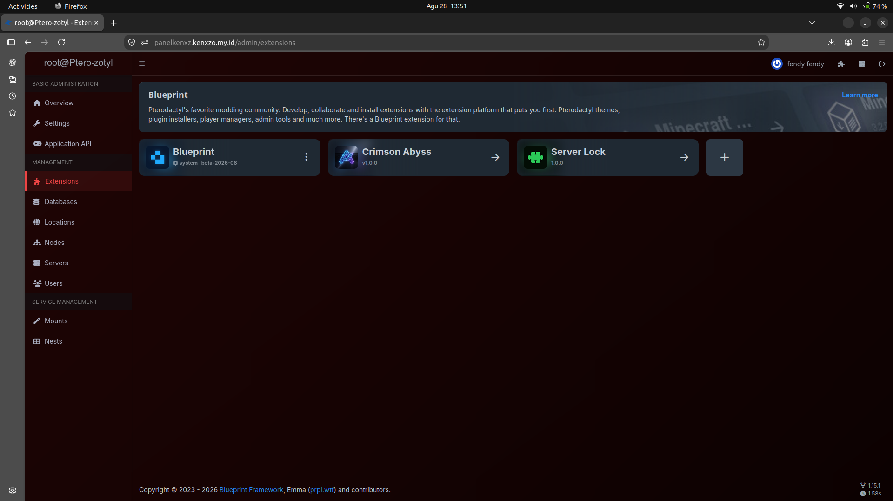

UNTUK VPS PTERO YANG UDAH DI INSTAL blueprint

## ServerLock Version Support



## Cara Install Blueprint (Prasyarat sebelum install ServerLock)

ServerLock membutuhkan [Blueprint Framework](https://github.com/BlueprintFramework/framework) sudah terpasang di panel Pterodactyl kamu.

### 1. Set path Pterodactyl
````bash
export PTERODACTYL_DIRECTORY=/var/www/pterodactyl
````

### 2. Install dependency dasar

````bash
sudo apt update
sudo apt install -y curl wget unzip
````

### 3. Download & extract Blueprint

````bash
cd "$PTERODACTYL_DIRECTORY"
wget "https://github.com/BlueprintFramework/framework/releases/latest/download/release.zip" -O "$PTERODACTYL_DIRECTORY/release.zip"
unzip -o release.zip
````

### 4. Install Node.js, yarn, dan dependency lain

````bash
sudo apt install -y ca-certificates curl git gnupg unzip wget zip

sudo mkdir -p /etc/apt/keyrings
curl -fsSL https://deb.nodesource.com/gpgkey/nodesource-repo.gpg.key | sudo gpg --dearmor -o /etc/apt/keyrings/nodesource.gpg
echo "deb [signed-by=/etc/apt/keyrings/nodesource.gpg] https://deb.nodesource.com/node_22.x nodistro main" | sudo tee /etc/apt/sources.list.d/nodesource.list
sudo apt update
sudo apt install -y nodejs

cd "$PTERODACTYL_DIRECTORY"
sudo npm i -g yarn
yarn install
````

### 5. Buat file `.blueprintrc`

````bash
echo \
'WEBUSER="www-data";
OWNERSHIP="www-data:www-data";
USERSHELL="/bin/bash";' > "$PTERODACTYL_DIRECTORY/.blueprintrc"
````

> Sesuaikan `WEBUSER`/`OWNERSHIP` kalau webserver kamu bukan pakai user `www-data` (mis. CentOS biasanya `nginx`).

### 6. Jalankan Blueprint installer

````bash
chmod +x "$PTERODACTYL_DIRECTORY/blueprint.sh"
sudo bash "$PTERODACTYL_DIRECTORY/blueprint.sh"
````

Verifikasi berhasil dengan:

````bash
blueprint -version
````

> ⚠️ **Backup dulu** folder panel + database sebelum menjalankan ini di server produksi. Referensi resmi: [blueprint.zip/guides/admin/install](https://blueprint.zip/guides/admin/install)
>
## Cara Install ServerLock

> Pastikan Blueprint Framework sudah terpasang dulu (lihat bagian instalasi Blueprint di atas).

````bash
cd /var/www

git clone https://github.com/kenzow-OfficialHost/serverlock-final.git

cd serverlock-final

chmod +x install.sh

./install.sh
````

Script `install.sh` ini otomatis akan:

1. Cek kamu jalan sebagai root
2. Cek Pterodactyl terpasang di `/var/www/pterodactyl`
3. Cek Blueprint (`blueprint -version`) sudah ada
4. Clone repo ServerLock ke folder sementara
5. Backup file-file panel yang bakal ditimpa (tersimpan di `/root/serverlock-backup-<tanggal>`)
6. Pasang runtime ServerLock (`app/`, `database/`, `resources/`, `routes/`)
7. Pasang file Blueprint extension-nya (tanpa menghapus extension lain yang sudah ada)
8. Jalankan migration database
9. Perbaiki permission `storage` & `bootstrap/cache`
10. Bersihkan cache Laravel
11. Build ulang frontend (`yarn build:production`)
12. Validasi otomatis: cek command, route, dan tabel database ServerLock

Setelah selesai, command yang tersedia:

````bash
php artisan serverlock:lock
php artisan serverlock:status
php artisan serverlock:unlock
````

Untuk reset password user tertentu:

````bash
/tmp/serverlock-final-install/scripts/serverlock-reset-user.sh USER_ID
````

> ⚠️ Backup manual folder panel + database juga disarankan sebelum menjalankan installer ini di server produksi, meskipun script sudah membuat backup otomatis.

````

Silakan gabungkan ke README, lalu commit seperti langkah sebelumnya (isi commit message, pilih commit ke `main`, klik **Commit changes**).
